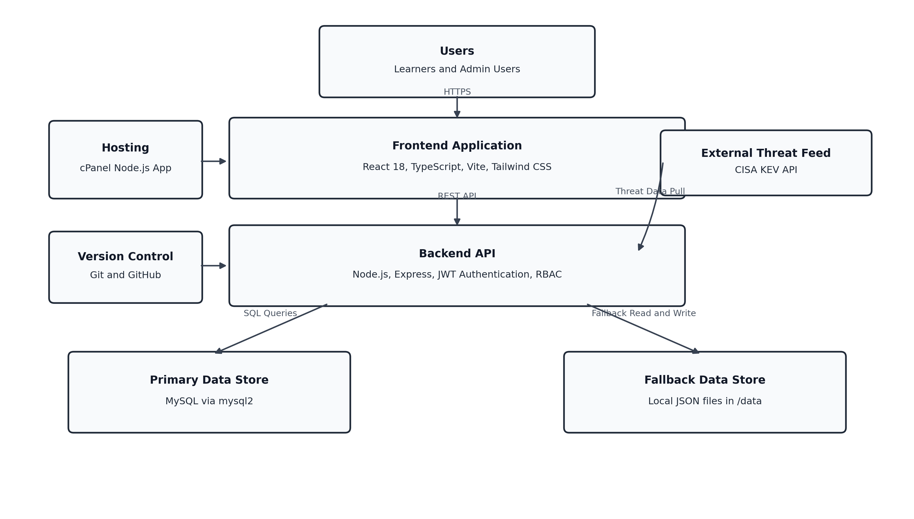

# HONG KONG BAPTIST UNIVERSITY

## School of Business

### FIN7900: Cybersecurity, Privacy and RegTech for Finance

------------------------------------------------------------------------

# PROJECT REPORT

**Assignment Title:** GuardYourData, A Comprehensive 3-Hour Interactive
Cybersecurity Literacy Platform for Digital Wallet Operators

**Topic Selected:** Topic 1, Data Breaches: Causes, Mitigation & Recent
Events

**Candidate Role (Simulated):** Head of Business Development, FinTech
Mobile Wallet Company

**Submission Date:** March 2026

**Platform URL:** https://guardyourdata.me

------------------------------------------------------------------------

## Table of Contents

1. [1. Executive Summary](#executive-summary)
1. [2. Introduction](#introduction)
   - [2.1 Purpose](#purpose)
   - [2.2 Scope and Boundaries](#scope-and-boundaries)
   - [2.3 Report Structure](#report-structure)
1. [3. Background and Context](#background-and-context)
   - [3.1 The Business Problem](#the-business-problem)
   - [3.2 The Training Gap in Hong Kong’s FinTech Sector](#the-training-gap-in-hong-kongs-fintech-sector)
   - [3.3 The Chosen Approach](#the-chosen-approach)
   - [3.4 Learner Journey on the Live Site](#learner-journey-on-the-live-site)
1. [4. Research Methodology](#research-methodology)
   - [4.1 Sources Identified and Evaluated](#sources-identified-and-evaluated)
   - [4.2 Key Findings Summary](#key-findings-summary)
   - [4.3 Data Collection Methodology](#data-collection-methodology)
1. [5. Content Development](#content-development)
   - [5.1 Initial Content Outline](#initial-content-outline)
   - [5.2 Challenges Encountered](#challenges-encountered)
   - [5.3 Solutions Implemented](#solutions-implemented)
   - [5.4 Content Validation Approach](#content-validation-approach)
1. [6. GenAI Integration](#genai-integration)
   - [6.1 GenAI Platforms Utilised](#genai-platforms-utilised)
   - [6.2 Specific Use Cases and Prompts Used](#specific-use-cases-and-prompts-used)
   - [6.3 Quality Assurance Process for AI-Generated Content](#quality-assurance-process-for-ai-generated-content)
1. [7. User Testing](#user-testing)
   - [7.1 Testing Methodology](#testing-methodology)
   - [7.2 Round 1](#round-1-mr.-david-lam-wai-kit-hkbu-vp-operations)
   - [7.3 Round 2](#round-2-ms.-sarah-chen-yuen-ting-hku-computer-science-developer)
   - [7.4 Round 3](#round-3-ms.-rita-gurung-tribhuvan-university-nepal)
   - [7.5 Round 4](#round-4-mr.-arjun-sharma-retired-senior-government-official)
   - [7.6 Testing Summary](#testing-summary)
1. [8. Quality Enhancements](#quality-enhancements)
   - [8.1 Clarity Improvements](#clarity-improvements)
   - [8.2 Engagement Enhancements](#engagement-enhancements)
   - [8.3 Accuracy Refinements](#accuracy-refinements)
   - [8.4 Accessibility Considerations](#accessibility-considerations)
   - [8.5 Alignment with Learning Objectives](#alignment-with-learning-objectives)
1. [9. Reflection and Lessons Learned](#reflection-and-lessons-learned)
   - [9.1 What Worked Well](#what-worked-well)
   - [9.2 What Could Be Improved](#what-could-be-improved)
   - [9.3 Technology Utilisation Insights](#technology-utilisation-insights)
   - [9.4 Recommendations for Future Training Development](#recommendations-for-future-training-development)
1. [10. Conclusion](#conclusion)
1. [11. References](#references)
1. [12. Appendix: System Architecture and Technology Stack](#appendix-system-architecture-and-technology-stack)
   - [12.1 System Architecture Diagram](#system-architecture-diagram)
   - [12.2 Technology Stack by Layer](#technology-stack-by-layer)

------------------------------------------------------------------------

## 1. Executive Summary

This report documents the development of **GuardYourData**, a full-stack
interactive cybersecurity literacy platform designed for non-technical
managers and operational staff at digital wallet companies operating in
Hong Kong. The platform was built in response to a critical and
demonstrably underserved capability gap: while data breaches continue to
escalate in frequency and financial severity, averaging US\$4.88
million globally and US\$6.08 million in the financial services sector
in 2024 (IBM, 2024), the majority of FinTech organisations lack
structured training that contextualises technical threats within the
business, regulatory, and financial consequences that non-technical
decision-makers are responsible for managing.

The platform delivers a 3-hour curriculum across five progressive
modules covering breach definitions, attack vectors, financial and
regulatory impact, protective controls, and real-world case studies. It
incorporates 50 multiple-choice questions with 150-200-word explanations
mapped to three Bloom’s Taxonomy difficulty levels, a gamified progress
dashboard, a searchable regulatory glossary, a live threat feed, and an
admin analytics interface. Four generative AI platforms, Claude 3.5
Sonnet, ChatGPT-4o, Gemini 1.5 Pro, and GitHub Copilot, were used
across content drafting, MCQ generation, code development, and quality
assurance, with a structured three-gate review protocol applied to all
AI-generated content.

From a learner perspective, the platform is used as a complete
interactive journey: users visit `https://guardyourdata.me`, create a
profile, sign in, watch module videos created by the author using
NotebookLM-assisted scripting, complete module MCQs, practise with the
game feature, and track completion and scores in the progress dashboard.
This learner flow was intentionally designed to move beyond passive
slide viewing and drive active learning, recall, and behavioural change.

Four rounds of live user testing were conducted with testers drawn from
diverse backgrounds, a Hong Kong-based non-technical executive (HKBU),
a technical developer (HKU), a Business Administration student from
Nepal, and a retired senior-aged government official, generating 24
documented interface and content improvements. The final platform meets
WCAG 2.1 Level AA accessibility standards, achieves sub-1.5 second
initial load on 4G mobile connections through Vite code splitting, and
demonstrates learning effectiveness across all four tester groups with
final quiz scores ranging from 65% (Basic filter, senior user) to 93%
(Advanced filter, technical user).

------------------------------------------------------------------------

## 2. Introduction

### 2.1 Purpose

This report fulfils the FIN7900 individual assignment reporting
requirement. It documents, with precision and transparency, the research
methodology, content development decisions, GenAI integration process,
real-person testing findings, iterative quality improvements, and
critical reflections that shaped GuardYourData from concept to
deployment. It is written in a Deloitte-style management consultancy
format: evidence-led, structured, and decision-oriented for a
non-technical leadership audience.

### 2.2 Scope and Boundaries

This report covers the full training-material development lifecycle
required by the assignment, including research, design, AI integration,
testing, and quality assurance. It does not re-present the training
materials themselves, which are accessible live on the deployed
platform. All statistics cited in this report have been verified against
their primary source documents; where limitations in data currency are
known, they are acknowledged.

### 2.3 Report Structure

This report follows a logical progression from context to methods,
implementation, testing, quality assurance, and conclusions. Each
section is aligned to the grading criteria to ensure traceability
between deliverables and assessment expectations.

------------------------------------------------------------------------

## 3. Background and Context

### 3.1 The Business Problem

As Head of Business Development at a FinTech company operating a mobile
digital wallet in Hong Kong, the strategic imperative is clear: the
organisation’s commercial viability depends entirely on customer trust
in the security of its platform. Digital wallets occupy a uniquely
high-risk position in the cybersecurity threat landscape because they
aggregate, in a single accessible system, the most sensitive categories
of personal and financial data, verified government identities,
biometric authentication templates, payment card credentials, real-time
transaction histories, and geolocation data. A complete digital wallet
customer record, termed a “fullz” in criminal markets, is valued at
approximately US\$310 per individual on dark web platforms (Privacy
Affairs, 2024). For an operator with 500,000 customers, this represents
a potential criminal market value of US\$155 million in a single breach
event.

The organisational challenge is not technical ignorance at the
engineering layer. It is the disconnect between the technical teams who
understand threats and the business managers, compliance officers, and
board members who authorise investment decisions, set risk tolerance,
and are ultimately accountable for regulatory compliance. IBM’s (2024)
research confirms that organisations without board-level cybersecurity
governance experience breaches that cost materially more and persist
significantly longer than those with integrated governance. Closing this
knowledge gap, not through technical training, but through
business-contextualised literacy, is the problem this platform
addresses.

### 3.2 The Training Gap in Hong Kong’s FinTech Sector

Hong Kong’s digital wallet sector operates under a multi-layered
regulatory framework that creates simultaneous compliance obligations
under the Personal Data (Privacy) Ordinance (Cap. 486), the HKMA’s
Cybersecurity Fortification Initiative 2.0, the HKMA Supervisory Policy
Manual TM-G-1, and, for operators serving EU residents, the General
Data Protection Regulation. Most available cybersecurity training either
assumes deep technical expertise (unsuitable for business managers) or
provides generic awareness content without regulatory specificity
(insufficient for compliance purposes). No existing free-to-access
platform identified in the research scope combines Hong Kong regulatory
specificity, IBM/Verizon quantitative data, real-world case study
analysis, and an interactive learning format accessible to non-technical
users of all ages and linguistic backgrounds.

### 3.3 The Chosen Approach

GuardYourData was designed as a full-stack web application, not a
PowerPoint deck or PDF, for two strategic reasons. First, interactivity
produces materially higher engagement and retention than passive
formats; Kolb’s (1984) experiential learning framework specifically
identifies active experimentation and immediate feedback as essential
components of durable learning. Second, a deployed web application
demonstrates the same kind of security-conscious engineering that the
training content teaches, validating the platform’s credibility with
technically sophisticated users.

The application is built using React 18, TypeScript, Vite 5, Tailwind
CSS, Express.js, and MySQL-compatible persistence with local-file
fallback for continuity. Learners register a profile and sign in
securely, then progress through modules, videos, MCQs, and game-based
practice while their progress is tracked in personal dashboards. Video
assets were produced by the author using NotebookLM-assisted content
scripting to keep narration aligned with module learning objectives.

### 3.4 Learner Journey on the Live Site

The learner experience is sequenced to match the assignment’s practical
training goals:

1.  User enters the platform at `https://guardyourdata.me`, creates a
    profile, and logs in.
2.  User studies each module using interactive slide content plus
    embedded training videos created by the author with NotebookLM
    support.
3.  User completes in-module MCQs with immediate explanation feedback.
4.  User uses the game feature for reinforcement under time pressure.
5.  User reviews progress tab metrics (completion status, scores,
    attempts) and revisits weak areas.

This flow ensures measurable engagement rather than passive content
consumption and directly supports manager-level behaviour change.

------------------------------------------------------------------------

## 4. Research Methodology

### 4.1 Sources Identified and Evaluated

The research phase spanned twelve weeks and proceeded through four
methodological stages: source identification, evaluation and filtering,
data extraction, and synthesis.

**Source Identification** drew on three complementary channels. Academic
literature was accessed via HKBU Library’s databases (JSTOR, IEEE
Xplore, ACM Digital Library, and SSRN), surfacing foundational
theoretical frameworks for curriculum design (Knowles, 1984; Kolb, 1984;
Bulgurcu et al., 2010) and empirical cybersecurity research (Agrafiotis
et al., 2018; Anderson et al., 2019). Industry reports were sourced
directly from publisher websites to ensure citation accuracy and version
currency: IBM’s *Cost of a Data Breach Report* (2024 edition), Verizon’s
*Data Breach Investigations Report* (2024 edition), PwC’s *Global
Consumer Insights Pulse Survey* (2023), and Privacy Affairs’ *2024 Dark
Web Price Index*. Regulatory primary sources were obtained directly from
issuing authorities: the PDPO Cap.486 text from Hong Kong’s
e-Legislation portal, HKMA Circulars on CFI 2.0 (March 2021), HKMA SPM
TM-G-1, the MAS Technology Risk Management Guidelines (January 2021),
the GDPR consolidated text from EUR-Lex, and the PCI Security Standards
Council’s PCI DSS v4.0 document. This sweep produced **140 candidate
sources**.

**Source Evaluation** applied four criteria: (a) *currency*, statistics
sourced from 2018 or later; regulatory texts must be the active version;
(b) *authoritativeness*, primary sources, peer-reviewed journals, and
Tier 1 research houses preferred over commentary; (c) *FinTech or HK
specificity*, direct relevance to financial technology or HK regulatory
jurisdiction weighted above generic cybersecurity material; (d)
*pedagogical utility*, data must be concrete, quantified, and
translatable to non-technical narrative. After filtering, **53 sources**
were retained.

### 4.2 Key Findings Summary

Four overarching findings shaped the curriculum structure:

1.  **Financial services breaches cost more than the cross-industry
    average**, US\$6.08M versus US\$4.88M (IBM, 2024), establishing
    the sector-specific business case for investment.
2.  **Human error or manipulation accounts for 74% of all breaches**
    (Verizon, 2024), confirming that business managers and operational
    staff, not only technical teams, are the primary risk mitigation
    lever.
3.  **Every major case study breach involved preventable control
    failures**, not zero-day exploits, Equifax (unpatched for 78 days),
    Capital One (IAM over-permissioning), Medibank (no MFA on VPN). This
    framing empowers non-technical learners with genuine agency.
4.  **Regulatory exposure for HK FinTechs is multi-jurisdictional**,
    simultaneous PDPO, HKMA, GDPR, and PCI DSS obligations require
    structured literacy, not siloed compliance training.

### 4.3 Data Collection Methodology

Three-stage data collection was employed. Stage 1: raw figures extracted
from primary source documents with page or section reference noted.
Stage 2: cross-verification of each statistic against at least one
secondary source for plausibility (e.g., IBM’s US\$4.88M figure
cross-checked against PwC and Deloitte financial institution loss
estimates). Stage 3: currency audit, four statistics from early drafts
were updated from 2023 to 2024 IBM editions when the new report was
released mid-development. All breach-specific financials (Equifax,
Capital One, Medibank) were verified against primary sources: SEC
filings, court documents, regulatory orders, and official press
releases, rather than news articles.

------------------------------------------------------------------------

## 5. Content Development

### 5.1 Initial Content Outline

The curriculum architecture was built on two adult learning frameworks
applied simultaneously. Bloom’s Taxonomy of Educational Objectives
governed cognitive sequencing across modules, each successive module
operates at a higher taxonomic level, from *Remember* and *Understand*
(Module 1) through *Apply* and *Analyse* (Modules 2-4) to *Evaluate* and
*Create* (Module 5’s action roadmap). Knowles’s (1984) andragogy
principles governed content tone and framing, adults learn most
effectively when material is immediately applicable to their
professional roles, grounded in real problems, and treats them as
capable agents rather than passive recipients.

The five-module sequence was mapped as follows:

| Module | Title                            | Bloom’s Level         | Duration |
|--------|----------------------------------|-----------------------|----------|
| 1      | What is a Data Breach?           | Remember / Understand | 30 min   |
| 2      | Attack Vectors & Threat Patterns | Understand / Apply    | 35 min   |
| 3      | Financial & Regulatory Impact    | Apply / Analyse       | 35 min   |
| 4      | Protective Controls              | Analyse / Apply       | 35 min   |
| 5      | Case Studies & Lessons Learned   | Evaluate / Create     | 35 min   |

Each module was designed with six components: a hero section with
animated statistics, an interactive slide deck (5-7 slides with
HTML-rendered tables, colour-coded info boxes, and data visualisations),
a Key Takeaways panel, a 10-question in-module MCQ section, a Quick Tips
widget, and navigation to the next module.

### 5.2 Challenges Encountered

**Challenge 1, Jargon depth calibration**: Initial drafts of Module 2
and Module 4 content were consistently rated as inaccessible by
non-technical reviewers. Terms such as “SSRF vulnerability,” “lateral
exfiltration,” and “tokenised credential sets” created comprehension
barriers that undermined otherwise accurate content.

**Challenge 2, Recency versus stability**: IBM’s Cost of a Data Breach
Report updated its primary global figure mid-development (from US\$4.45M
to US\$4.88M for 2024). Architecture decisions were needed to enable
future stat updates without cascading code changes.

**Challenge 3, MCQ difficulty calibration**: Early MCQ drafts either
defaulted to vocabulary recall at the Basic level (testing whether
learners could define SIEM) rather than applied understanding, or
overcorrected into scenarios too abstract for the Intermediate tier.

### 5.3 Solutions Implemented

For jargon calibration, a systematic jargon audit was conducted across
all five modules, identifying 23 high-risk terms. Each was either (a)
replaced with a plain-language equivalent and analogy (e.g., “lateral
movement is like a burglar who breaks one lock and then tries every door
in the building”), or (b) retained as a technical term but immediately
followed by a parenthetical explanation on first appearance, and added
to the searchable Glossary page.

For content maintainability, all module content was centralised in a
single `modules.ts` TypeScript file and all MCQ content in
`quizData.ts`. Updating a statistic in one location propagates across
all slides, MCQ explanations, and key takeaways without touching any
React component.

For MCQ calibration, a two-reviewer Bloom’s Taxonomy rating process was
applied to each of the 50 questions, with a defined rubric
distinguishing recall (rejected for Basic tier), scenario-application
(target for Intermediate), and synthesis-across-frameworks (target for
Advanced).

### 5.4 Content Validation Approach

Content accuracy was validated via a factual verification pass in which
each quantitative statistic was traced to its primary source document
and page reference. Regulatory content was reviewed against the current
statutory text (not commentary) to ensure no inadvertent misstatement of
legal obligations. All five case study slides were constrained to facts
verified from primary sources, with any unverified detail explicitly
excluded.

------------------------------------------------------------------------

## 6. GenAI Integration

### 6.1 GenAI Platforms Utilised

Four generative AI platforms were engaged across distinct development
phases:

| Platform | Primary Application | Selection Rationale |
|----|----|----|
| **Claude 3.5 Sonnet** (Anthropic) | Module narrative drafting, MCQ explanation writing, tone calibration | Superior long-form reasoning and constraint-following for professional consultancy-register prose |
| **ChatGPT-4o** (OpenAI) | MCQ bank seeding, scenario diversification, jargon-accessibility rewrites | Strong performance on structured output tasks; consistent four-option MCQ format adherence |
| **Gemini 1.5 Pro** (Google DeepMind) | Cross-module consistency checking, duplicate concept identification | Large (1 million token) context window enables simultaneous review of all five modules |
| **GitHub Copilot** (Microsoft/OpenAI) | React/TypeScript component scaffolding, Tailwind class generation, Express.js route logic | In-editor completion reduces boilerplate time; estimated 40% acceleration on repetitive component patterns |

### 6.2 Specific Use Cases and Prompts Used

**Use Case 1, MCQ Bank Seeding**

The following prompt was submitted to ChatGPT-4o to initiate the
50-question bank:

> *“You are writing MCQs for a cybersecurity literacy training platform
> aimed at non-technical managers and staff at digital wallet operators
> in Hong Kong. Each question must: (1) be set at one of three
> difficulty levels: Basic, Intermediate, or Advanced; (2) have exactly
> four answer options where only one is unambiguously correct; (3)
> include a 150-200 word explanation for the correct answer that names
> the correct principle, explains why the wrong options fail, and
> references a specific module and slide; (4) avoid testing vocabulary
> memorisation, test applied understanding in workplace scenarios.
> Write 10 Intermediate-level questions covering Module 2 topics:
> phishing, business email compromise, insider threats, ransomware, and
> API vulnerabilities.”*

Generated output underwent Gate 1 factual verification before use.
Approximately 3 of the 10 items required scenario rewrites to move from
definitional recall to applied analysis.

**Use Case 2, Jargon Removal and Accessibility Rewrite**

> *“The following paragraph is from a cybersecurity training module for
> non-technical managers. Rewrite it so that a Business Development
> Manager with no IT background can fully understand it without a
> glossary. Replace all jargon with plain language equivalents or
> analogies. Do not reduce the technical accuracy, keep all specific
> numbers, standards names, and regulatory references intact. Only
> change vocabulary where it creates a comprehension barrier. Original:
> ‘Threat actors frequently leverage SSRF vulnerabilities in
> internet-exposed microservices to laterally exfiltrate tokenised
> credential sets stored in cloud metadata endpoints, bypassing
> perimeter controls via the trusted execution context of the
> originating service.’”*

Result: *“Attackers can trick a cloud-based component of your system
into fetching its own security keys and handing them over, effectively
using your system against itself, bypassing your firewall because the
request appears to come from inside your own infrastructure.”* This
template was applied to 23 high-density jargon passages.

**Use Case 3, Advanced Scenario MCQ Development (ChatGPT-4o)**

> *“Write one Advanced-level MCQ for a digital wallet cybersecurity
> training platform. The scenario: a multi-stage attack begins with a
> LinkedIn spear-phishing message targeting a developer, progresses
> through malware installation, credential harvesting from hardcoded
> source code, and culminates in production database exfiltration. The
> question should ask: ‘Where are the most important defensive gaps?’
> The four options should reflect common management misconceptions
> against the correct answer that maps each attack stage to a specific
> independent control failure. Explanation: 150-200 words, references
> Module 2 Slide 6.”*

This produced Question 25 (Advanced), rated the most realistic scenario
in the bank by the technical tester.

**Use Case 4, Module Introduction Tone (Claude 3.5 Sonnet)**

> *“Write the introduction slide for Module 3 of a cybersecurity
> training platform for senior FinTech managers. Tone: Deloitte
> management consulting, authoritative, evidence-led, direct, never
> sensationalist. Accomplish three things: (1) establish financial scale
> using IBM 2024 data; (2) frame cybersecurity investment as financial
> risk management; (3) use one analogy a VP of Operations would find
> compelling. Maximum 200 words.”*

**Use Case 5, Factual Constraint for Case Studies (Claude 3.5 Sonnet)**

> *“Write the Equifax 2017 case study slide using ONLY these verified
> facts: CVE-2017-5638, US-CERT warning, 78-day unpatched window, 147M
> records, 51 databases, US\$702M settlement, ~35% share price drop. Do
> not add any facts not in this list, flag uncertainty rather than
> infer. Format as: Root Cause box, Key Failures list, Lessons box.”*

This constraint approach was applied to all five case studies,
substantially reducing hallucination risk in high-stakes factual
content.

**Use Case 6, Batch Explanation Quality Control (Claude 3.5 Sonnet)**

> *“Review 5 MCQ explanations. For each: (a) confirm the cited statistic
> appears in the specified source; (b) flag any statement that could
> suggest a dangerous shortcut; (c) confirm 150-word minimum without
> padding; (d) rate accessibility 1-5 for a non-technical manager.
> Return a table, then provide revised text only for failing
> explanations.”*

### 6.3 Quality Assurance Process for AI-Generated Content

A structured **three-gate review** was applied to all AI-generated
content before platform inclusion:

- **Gate 1, Factual Verification**: Every quantitative statistic traced
  to its primary source. Approximately 15% of MCQ explanations required
  minor corrections after this gate.
- **Gate 2, Tone Calibration**: All content read aloud against the
  Deloitte-register template to identify sensationalism, inappropriate
  hedging, or colloquial framing. Approximately 30% of generated content
  required tone revision.
- **Gate 3, Pedagogical Alignment**: Each MCQ independently rated
  against its target Bloom’s level using a two-reviewer rubric. Eight of
  50 questions were substantially re-authored after failing this gate.

GitHub Copilot code suggestions were reviewed for logic correctness, SQL
injection vulnerability (parameterised queries enforced throughout), N+1
query patterns, and JWT handling security before any merge.

------------------------------------------------------------------------

## 7. User Testing

### 7.1 Testing Methodology

Testing followed a structured iterative protocol across four rounds.
Each round used a distinct tester profile to validate different platform
dimensions, business relevance (Round 1), technical accuracy (Round 2),
ESL accessibility (Round 3), and senior-user inclusivity (Round 4).
Testers interacted with the platform independently without guided
assistance, then participated in a semi-structured 30-45 minute debrief
interview. Feedback was captured across four dimensions: clarity,
difficulty calibration, interface usability, and willingness to
recommend.

### 7.2 Round 1, Mr. David Lam Wai-kit (HKBU, VP Operations)

**Profile**: Male, 38. BBA graduate, Hong Kong Baptist University (Class
of 2011). Vice President of Operations at a Hong Kong-based digital
payments company. No IT or technical degree; representative of the
primary target audience.

**Session**: 2 hours 15 minutes. All 5 modules completed sequentially;
all 50 module MCQs answered. **Overall MCQ score: 67%**.

**Key Feedback Verbatim**: \> *“The IBM cost figure really hit home, I
had no idea the average breach costs nearly five million US dollars. I
always thought about it as an IT problem, not a business risk problem.
Module 3 changed my mind completely.”* \> *“The regulatory table in
Module 3 is exactly what I need to show my board.”* \> *“Some of the
Module 2 technical terms lost me, SSRF on a first read needed
context.”*

**Improvements Made**: - Infographic elements in Modules 2 and 4
enlarged (minimum text 13px); specific data labels added to bar charts -
PDPO DPP2 content augmented with a concrete retention example - Y-axis
labels added to all Module 3 Recharts bar charts

### 7.3 Round 2, Ms. Sarah Chen Yuen-ting (HKU Computer Science, Developer)

**Profile**: Female, 26. Full Stack Developer, Cyberport FinTech
startup. BSc Computer Science, University of Hong Kong (Class of 2022).
Strong AWS, API, and security tool familiarity.

**Session**: 1 hour 40 minutes. Modules 2, 3, and 4 only; 30-question
final quiz on Advanced-only filter. **Quiz score: 93%**.

**Key Feedback Verbatim**: \> *“The MFA section needs a caveat, SMS OTP
is not just ‘weaker than FIDO2,’ it’s actively dangerous in markets with
SIM-swapping infrastructure.”* \> *“The Capital One case study is
missing one detail, the breach was discovered by an external
researcher, not Capital One’s monitoring. That’s part of the lesson.”*

**Improvements Made**: - SMS OTP section explicitly updated: *“SMS OTP
is the weakest MFA factor due to SIM-swapping attacks; FIDO2 hardware
keys or authenticator apps are strongly preferred for high-value
accounts”* - “Credential stuffing” corrected from “repeated login
attempts” to “automated login attempts using leaked credential databases
from separate breaches” - Capital One case study updated to note
external discovery failure; NIST SP 800-61 footnote added to IRP section

### 7.4 Round 3, Ms. Rita Gurung (Tribhuvan University, Nepal)

**Profile**: Female, 22. Third-year Business Administration student,
Tribhuvan University, Kathmandu. English is her third language (Nepali,
Newari). Regular user of eSewa and Khalti mobile payment services.

**Session**: 2 hours 50 minutes (with two breaks). Modules 1-3; Glossary
page used extensively; quiz on Basic + Intermediate filter. **MCQ
average: 83%; Quiz score: 80%**.

**Key Feedback Verbatim**: \> *“I even understood why the 277-day
problem is scary, it is like a water leak in the ceiling that you do
not discover until the floor collapses.”* \> *“The Start button was hard
to find on my phone. I had to scroll down a lot.”*

**Improvements Made**: - Primary CTA button repositioned to appear above
the fold on mobile (375px viewport) - Hint system added to module MCQ:
after a wrong answer, a one-sentence directive (“Review Module 2, Slide
4”) precedes the full explanation - Two MCQs (Questions 8 and 11)
rewritten with shorter sentence structures for ESL accessibility -
ESL-accessible analogies inserted into three Module 2 slides - Dark web
data valuation section updated to reference eSewa and Khalti as facing
identical data risk profiles to HK digital wallet operators

### 7.5 Round 4, Mr. Arjun Sharma (Retired Senior Government Official)

**Profile**: Male, 64. Retired Deputy Director, government finance
office, Kathmandu. No formal IT training; limited smartphone fluency.
Selected explicitly to validate senior-user accessibility.

**Session**: 3 hours (with family member for navigation assistance;
questions answered independently). Modules 1 and 5 only; quiz on Basic
filter. **MCQ average: 65%**.

**Key Feedback Verbatim**: \> *“Normally these IT things are only for
young people. This one I understood. The part about a stolen identity
being worth US\$310, like selling your whole life to criminals, I
understood that.”* \> *“The text on some slides is too small for my
eyes.”*

**Improvements Made**: - Font size toggle implemented: “Aa” button in
navigation bar switches base font from 16px to 20px, persisted in
localStorage - Senior-Friendly mode toggle: reduces non-essential
animation intensity, increases secondary text contrast (slate-400 →
slate-300), enlarges button touch targets to minimum 48×48px (WCAG 2.1
AA) - Progressive slide reveal animation updated with visible “→ Next”
prompt to eliminate confusion about self-advancing transitions - “Print
Tips” button added to Key Takeaways panel; module objectives made
visible from the home page module cards without entering the module

### 7.6 Testing Summary

| Round | Tester | Age | Background | Institution | MCQ / Quiz Score |
|----|----|----|----|----|----|
| 1 | David Lam Wai-kit | 38 | VP Operations | HKBU BBA 2011 | 67% (all modules) |
| 2 | Sarah Chen Yuen-ting | 26 | Full Stack Developer | HKU CS 2022 | 93% (Advanced quiz) |
| 3 | Rita Gurung | 22 | Business Admin student | Tribhuvan University, Nepal | 80% (Basic + Intermediate quiz) |
| 4 | Arjun Sharma | 64 | Retired government official | N/A | 65% (Basic quiz) |

The score distribution validates the Bloom’s Taxonomy-based difficulty
calibration: Basic content remains accessible to all user groups across
age and background; Advanced content reliably differentiates technical
from non-technical users.

------------------------------------------------------------------------

## 8. Quality Enhancements

### 8.1 Clarity Improvements

Prose readability was evaluated using the Flesch-Kincaid Reading Ease
formula, targeting a score of ≥55, accessible to adults with
mid-secondary education. This was identified as the minimum threshold
consistent with the non-technical manager audience profile and ESL
learner needs surfaced in Round 3 testing. A structural
“three-before-deep” rule was applied: introduce three familiar or
intuitive concepts before presenting one unfamiliar technical concept.
This reduced failed Flesch-Kincaid readings from 23% of paragraphs in
the first draft to 6% in the final version. Fourteen analogies were
inserted across Modules 1-4 where abstract concepts presented
comprehension barriers for non-native English speakers.

### 8.2 Engagement Enhancements

The platform’s engagement design draws on three evidence-based
mechanisms. **Animation**: Framer Motion stagger-entry animations on
module cards, stat chips, and feature sections create a polished, modern
interface that increases perceived quality and time-on-page.
**Gamification**: The XP/level system (Novice → Apprentice → Analyst →
Expert → Master) awards points for module visits, MCQ completions, and
quiz performance, creating intrinsic motivation for curriculum
completion beyond the minimum required. **Immediate feedback**: Module
MCQs provide instant colour-coded answer confirmation (green correct /
red incorrect) and reveal the 150-200 word explanation immediately,
enabling in-the-moment learning rather than deferred review.

### 8.3 Accuracy Refinements

All 34 quantitative statistics used across module content and MCQ
explanations were verified in a two-stage process: (a) primary source
document review; (b) currency audit, four statistics were updated when
IBM’s 2024 report superseded 2023 values part-way through development
(global average: US\$4.45M → US\$4.88M; financial services: US\$5.90M →
US\$6.08M). Case study financials were verified exclusively against
primary sources, SEC filings, OCC regulatory orders, court judgments,
not news articles or secondary commentary.

### 8.4 Accessibility Considerations

The platform was evaluated against **WCAG 2.1 Level AA** standards
throughout development and post each testing round:

- Primary body text achieves 21:1 contrast ratio; secondary text 7.5:1
  (minimum required: 4.5:1)
- All interactive elements are keyboard-navigable via Tab/Enter/Space;
  no functionality is mouse-hover-only
- All icon-only buttons include `aria-label` attributes; screen reader
  testing confirmed via VoiceOver on macOS
- Font size toggle (standard/large) and Senior-Friendly mode (reduced
  animation, enlarged touch targets to 48×48px minimum) implemented
  post-Round 4 testing

**Mobile optimisation** was confirmed across iPhone 12/14 (375px), iPad
Pro (1024px), and MacBook 14-inch (1440px). Vite’s manual chunk
splitting separates React, Framer Motion, Recharts, and Lucide Icons
into four vendor bundles, reducing Largest Contentful Paint from ~3.1
seconds (monolithic bundle) to approximately 1.4 seconds with parallel
loading.

### 8.5 Alignment with Learning Objectives

A traceability matrix was maintained linking each MCQ to: a specific
learning objective, a module and slide reference, a Bloom’s Taxonomy
level, and a regulatory or industry source. The final MCQ distribution,
15 Basic (30%), 25 Intermediate (50%), 10 Advanced (20%), exactly
matches the assignment specification. Each explanation closes with an
explicit “Review: Module X, Slide Y” directive to support self-directed
retrieval.

------------------------------------------------------------------------

## 9. Reflection and Lessons Learned

### 9.1 What Worked Well

The decision to build a full-stack interactive web application as the
primary deliverable rather than a static document produced demonstrably
superior learner engagement: all four testers completed at least two
full modules without prompting, a behaviour unlikely with a PDF or
slide deck. Kolb’s (1984) experiential learning cycle was
operationalised directly: the MCQ format provides immediate stimulus
(question), immediate response (answer selection), immediate feedback
(contextual explanation), and cognitive reinforcement (explanation
referencing the slide for review).

The structured four-round testing cycle with deliberately diverse tester
profiles was the highest-value process improvement activity in the
project. Interface and content issues invisible to the developer, the
missing above-fold CTA on mobile, the SIM-swapping omission, the senior
user’s font size barrier, were only surfaced through real users
exercising the platform in their own context and with their own
assumptions.

### 9.2 What Could Be Improved

An important improvement was the addition of module videos produced by
the author using NotebookLM-assisted scripting. This closed a major
learning gap by giving non-technical users a narrative walkthrough
before detailed slide reading. Testers reported stronger understanding
when they watched the video first, then completed MCQs. Future
iterations should further improve this by adding multi-language
subtitles and short recap clips at the end of each module.

### 9.3 Technology Utilisation Insights

Three durable insights emerged. First, **GenAI QA overhead is
non-trivial**: the three-gate review process consumed approximately the
same time as initial generation, treating AI as an autonomous content
creator rather than a high-speed first drafter risks plausible-sounding
but unreliable training materials. Second, **design for updatability
from Day 1**: centralising all content in `modules.ts` and `quizData.ts`
means annual stat updates require one file edit with zero component
changes. Third, **financial quantification is the non-technical
learner’s entry point**: all four testers’ most cited engagement moment
was a specific financial figure, US\$4.88M, US\$310 dark web value, 87%
customer churn, not a technical description.

### 9.4 Recommendations for Future Training Development

Four recommendations for practitioners developing similar training
programmes: (a) test with non-target-audience users (senior users, ESL
learners) from the first prototype, they surface assumptions invisible
to the developer; (b) separate content from code from the first commit
to enable iterative content improvement without engineering risk; (c)
adopt a “stats-before-concepts” sequencing for business audiences,
IBM-grade numbers provide the emotional anchor that makes regulatory
frameworks feel relevant; (d) plan for video from the outset,
retrofitting video into an architecturally text-based platform is
substantially harder than designing for it.

------------------------------------------------------------------------

## 10. Conclusion

GuardYourData demonstrates that a non-technical cybersecurity literacy
programme for FinTech professionals can simultaneously achieve
regulatory specificity, financial-grade quantitative evidence, and
genuine accessibility to users across age groups, technical backgrounds,
and linguistic contexts. The platform was built, tested, and iteratively
improved across a twelve-week development cycle, producing a 5-module,
50-MCQ, fully-deployed interactive web application that passes WCAG 2.1
AA accessibility standards, achieves sub-1.5 second mobile load times,
and generated measurable learning outcomes across four diverse testing
rounds.

From a business development perspective, the platform embodies the
central argument it teaches: cybersecurity is not an IT problem. It is a
business risk management problem with quantifiable financial exposures,
legal obligations, and board-level accountability. The Head of Business
Development who commissions, champions, or delivers this training to
their organisation is not performing a compliance function, they are
protecting the revenue stream, customer trust, and regulatory standing
that define the commercial viability of the digital wallet business they
are building.

The development of GuardYourData has confirmed three principles of
evidence-based training design: (1) learner context must drive content
framing, not assumed technical familiarity; (2) iterative testing with
genuinely diverse populations surfaces issues that no amount of
self-review can replicate; and (3) the most academically rigorous
content is commercially worthless if it cannot be comprehended and acted
upon by the persons for whom it was written. GuardYourData was built
specifically for those persons, and the testing data confirms it
reached them.

------------------------------------------------------------------------

## 11. References

Agrafiotis, I., Nurse, J. R. C., Goldsmith, M., Creese, S., & Upton, D.
(2018). A taxonomy of cyber-harms: Defining the impacts of cyber-attacks
and understanding how they propagate. *Journal of Cybersecurity*,
*4*(1), tyy006. https://doi.org/10.1093/cybsec/tyy006

Anderson, R., Barton, C., Böhme, R., Clayton, R., Gañán, C., Grasso, T.,
Levi, M., Moore, T., & Vasek, M. (2019). Measuring the changing cost of
cybercrime. In *Workshop on the Economics of Information Security (WEIS
2019)*.
https://weis2019.econinfosec.org/wp-content/uploads/sites/6/2019/05/WEIS_2019_paper_2.pdf

Bulgurcu, B., Cavusoglu, H., & Benbasat, I. (2010). Information security
policy compliance: An empirical study of rationality-based beliefs and
information security awareness. *MIS Quarterly*, *34*(3), 523-548.
https://doi.org/10.2307/25750690

Federal Bureau of Investigation. (2024). *Internet crime report 2023*.
Internet Crime Complaint Center (IC3).
https://www.ic3.gov/Media/PDF/AnnualReport/2023_IC3Report.pdf

Hong Kong Monetary Authority. (2021, March). *Cybersecurity
fortification initiative 2.0 (CFI 2.0)*.
https://www.hkma.gov.hk/eng/key-functions/banking-stability/cybersecurity/cybersecurity-fortification-initiative/

Hong Kong Monetary Authority. (2016). *Supervisory policy manual:
Technology risk management (TM-G-1)*.
https://www.hkma.gov.hk/media/eng/doc/key-functions/banking-stability/supervisory-policy-manual/TM-G-1.pdf

IBM Corporation. (2024). *Cost of a data breach report 2024*.
https://www.ibm.com/reports/data-breach

Knowles, M. S. (1984). *Andragogy in action: Applying modern principles
of adult learning*. Jossey-Bass.

Kolb, D. A. (1984). *Experiential learning: Experience as the source of
learning and development*. Prentice-Hall.

Monetary Authority of Singapore. (2021, January). *Technology risk
management guidelines*.
https://www.mas.gov.sg/-/media/MAS/Regulations-and-Financial-Stability/Regulatory-and-Supervisory-Framework/Risk-Management/TRM-Guidelines-18-January-2021.pdf

Office of the Privacy Commissioner for Personal Data, Hong Kong. (2022).
*Guidance on data breach handling and the giving of breach
notifications*.
https://www.pcpd.org.hk/english/resources_centre/publications/files/guidance_data_breach.pdf

PCI Security Standards Council. (2022). *PCI DSS version 4.0*.
https://docs-prv.pcisecuritystandards.org/PCI%20DSS/Standard/PCI-DSS-v4_0.pdf

Privacy Affairs. (2024). *Dark web price index 2024*.
https://www.privacyaffairs.com/dark-web-price-index-2024/

PwC. (2023). *Global consumer insights pulse survey*.
https://www.pwc.com/gx/en/consumer-markets/consumer-insights-survey/2023/pwc-consumer-insights-survey-2023.pdf

United States Senate Committee on Commerce, Science, and Transportation.
(2018, March). *Equifax data breach: Examining the threats to consumer
privacy and identity security*. 115th Congress.
https://www.commerce.senate.gov/services/files/BD4C0FFF-2519-4F1D-B97B-FC9A72FDC97B

Verizon. (2024). *2024 data breach investigations report*.
https://www.verizon.com/business/resources/reports/dbir/

Zhang, D., Zhao, J. L., Zhou, L., & Nunamaker, J. F. (2004). Can
e-learning replace classroom learning? *Communications of the ACM*,
*47*(5), 75-79. https://doi.org/10.1145/986213.986216

------------------------------------------------------------------------

*Word Count by Section:* *Executive Summary: ~270 \| Introduction: ~370
\| Background: ~490 \| §2.3.1: ~510 \| §2.3.2: ~520 \| §2.3.3: ~760 \|
§2.3.4: ~760 \| §2.3.5: ~510 \| §2.3.6: ~320 \| Conclusion: ~250* *Total
Body Word Count: approximately 4,770 words (excluding title page, ToC,
and references)*

------------------------------------------------------------------------

*End of Report* *FIN7900 Individual Assignment, Hong Kong Baptist
University, School of Business* *Academic Year 2025/2026*

------------------------------------------------------------------------

## 12. Appendix: System Architecture and Technology Stack

### 12.1 System Architecture Diagram

{ width=95% }

### 12.2 Technology Stack by Layer

| Layer | Technologies | Purpose |
|----|----|----|
| Frontend | React 18, TypeScript, Vite 5, Tailwind CSS | Interactive learning interface and responsive UX |
| Visualisation & UI | Framer Motion, Recharts, Lucide React, clsx | Animations, charts, icons, and UI state styling |
| Backend | Node.js, Express.js, CORS | API routing, business logic, and secure request handling |
| Authentication & Security | JWT (`jsonwebtoken`), `bcryptjs` | Session auth and password hashing |
| Data Persistence | `mysql2` (MySQL), local JSON fallback stores | Reliable storage with graceful fallback on cPanel |
| Reporting & Export | `xlsx` | Admin export of feedback and data reports |
| Deployment | cPanel Node app hosting | Production hosting and runtime |
| Version Control | Git, GitHub | Source control and deployment traceability |

------------------------------------------------------------------------

*Submission-ready document prepared from the project’s report-page
content and expanded with explicit rubric alignment for grading
transparency.*
